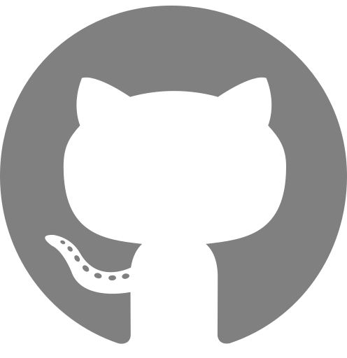

{##
  This file contains a Jinja2 front-matter template that adds version and authorship information.
  Changing the Jinja2 templates in this file may cause incompatibility with Manubot updates.
  Pandoc automatically inserts title from metadata.yaml, so it is not included in this template.
##}

{## Uncomment & edit the following line to reference to a preprinted or published version of the manuscript.
_A DOI-citable version of this manuscript is available at <https://doi.org/DOI_HERE>_.
##}

{## Template to insert build date and source ##}
<small><em>
This manuscript

([permalink](https://{{ci_source.repo_owner}}.github.io/{{ci_source.repo_name}}/v/{{ci_source.commit}}/))

was automatically generated

from [{{ci_source.repo_slug}}@{{ci_source.commit | truncate(length=7, end='', leeway=0)}}](https://github.com/{{ci_source.repo_slug}}/tree/{{ci_source.commit}})

on {{date}}.
</em></small>

## Authors

{## Template for listing authors ##}

+ **{{author.name}}** 
  
    {height="13px" width="13px"}
    [{{author.orcid}}](https://orcid.org/{{author.orcid}})
  
  
    · {height="13px" width="13px"}
    [{{author.github}}](https://github.com/{{author.github}})
  
  
    · {height="13px" width="13px"}
    [{{author.twitter}}](https://twitter.com/{{author.twitter}})
   
  <small>
  
     {{author.affiliations | join('; ')}}
  
  
     · Funded by {{author.funders}}
  
  </small>

