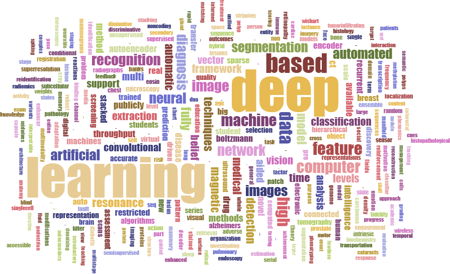

## Introduction to deep learning

Biology and medicine are rapidly becoming data-intensive. A recent comparison of
genomics with social media, online videos, and other data-intensive disciplines
suggests that genomics alone will equal or surpass other fields in data
generation and analysis within the next decade
[@doi:10.1371/journal.pbio.1002195]. The volume and complexity of these data
present new opportunities, but also pose new challenges. Automated algorithms
that extract meaningful patterns could lead to actionable knowledge and change
how we develop treatments, categorize patients, or study diseases, all within
privacy-critical environments.

The term _deep learning_ has come to refer to a collection of new techniques that,
together, have demonstrated breakthrough gains over existing best-in-class
machine learning algorithms across several fields. Over the past
five years these methods have revolutionized image classification and speech
recognition due to their flexibility and high accuracy
[@doi:10.1038/nature14539]. More recently, deep learning algorithms have shown
promise in fields as diverse as high-energy physics [@doi:10.1038/ncomms5308],
dermatology [@doi:10.1038/nature21056], and translation among written languages
[@arxiv:1609.08144]. Across fields, "off-the-shelf" implementations of these
algorithms have produced comparable or higher accuracy than previous
best-in-class methods that required years of extensive customization, and
specialized implementations are now being used at industrial scales.

Neural networks were first proposed in 1943 [@doi:10.1007/BF02478259] as a model
for how our brains process information. The history of neural networks is
interesting in its own right [@doi:10.1103/RevModPhys.34.135]. In neural
networks, inputs are fed into a hidden layer, which feeds into one or more subsequent
hidden layers, which eventually produce an output layer. The neural networks
used for deep learning have multiple hidden layers. Each layer essentially
performs feature construction for the layers before it. The training process
used often allows layers deeper in the network to contribute to the refinement
of earlier layers. For this reason, these algorithms can automatically engineer
features that are suitable for many tasks and customize those features for one
or more specific tasks. Deep learning does many of the same things as more
familiar machine learning approaches [@doi:10.1038/nrg3920].
Like a clustering algorithm, it can build features that
describe recurrent patterns in data. Like a regression approach, deep learning
methods can predict some output. However, deep learning methods combine both of
these steps. When sufficient data are available, these methods construct
features tuned to a specific problem and combine those features into a
predictor. Recently, hardware improvements and very
large training datasets have allowed these deep learning techniques to surpass
other machine learning algorithms for many problems.

Neural networks are most widely associated with supervised machine learning,
where the goal is to accurately predict one or more labels associated with each
data point. However, deep learning algorithms can also be used in an
exploratory, "unsupervised" mode, where the goal is to summarize, explain, or
identify interesting patterns in a data set.  In a famous early example,
scientists from Google demonstrated that a neural network "discovered" that
cats, faces, and pedestrians were important components of online videos
[@url:http://research.google.com/archive/unsupervised_icml2012.html] without
being told to look for them. What if, more generally, deep learning could solve
the challenges presented by the growth of data in biomedicine? Could these
algorithms identify the "cats" hidden in our data -- the patterns unknown to the
researcher -- and suggest ways to act on them? In this review, we examine deep
learning's application to biomedical science and discuss the unique challenges
that biomedical data pose for deep learning methods.

Several important advances make the current surge of work done in this area
possible. Easy-to-use software packages have brought the techniques of the field
out of the specialist's toolkit to a broad community of computational
scientists. Additionally, new techniques for fast training have enabled their
application to larger datasets [@arxiv:1106.5730]. Dropout of nodes, edges, and
layers makes networks more robust, even when the number of parameters is very
large. New neural network approaches are also well-suited for addressing
distinct challenges. For example, neural networks structured as autoencoders or
as adversarial networks require no labels and are now regularly used for
unsupervised tasks. In this review, we do not exhaustively discuss the different
types of deep neural network architectures. A recent book from Goodfellow et al.
[@url:http://www.deeplearningbook.org/] covers these in detail. Finally, the
larger datasets now available are also sufficient for fitting the many
parameters that exist for deep neural networks. The convergence of these factors
currently makes deep learning extremely adaptable and capable of addressing the
nuanced differences of each domain to which it is applied.

### Will deep learning transform the study of human disease?

With this review, we ask the question: what is needed for deep learning to
transform how we categorize, study, and treat individuals to maintain or restore
health? We choose a high bar for "transform." Andrew Grove, the former CEO of
Intel, coined the term Strategic Inflection Point to refer to a change in
technologies or environment that requires a business to be fundamentally
reshaped [@url:http://www.intel.com/pressroom/archive/speeches/ag080998.htm].
Here, we seek to identify whether deep learning is an innovation that can induce
a Strategic Inflection Point in the practice of biology or medicine.

There are already a number of reviews focused on applications of deep learning
in biology [@doi:10.1038/nbt.3313; @doi:10.1021/acs.molpharmaceut.5b00982;
@doi:10.15252/msb.20156651; @doi:10.1093/bib/bbw068;
@doi:10.3109/10409238.2015.1135868], healthcare [@doi:10.1093/bib/bbx044;
@tag:Litjens2017_medimage_survey], and drug discovery [@doi:10.1002/minf.201501008;
@doi:10.1002/jcc.24764; @tag:PerezSianes2016_screening;
@tag:Baskin2015_drug_disc]. 

In addition, we find in PubMed that the number of deep-learning related articles has doubled each year since 2013. 
Figure @fig:wordcloud highlights the most frequent keywords in those articles (xx in total) as a word cloud. 

{#fig:wordcloud width="100%"}

Under our guiding question, we sought to highlight
cases where deep learning enabled researchers to solve challenges that were
previously considered infeasible or simplified tedious analyses.
We also identified approaches that researchers are using to address challenges
posed by biomedical data. We find that domain-specific considerations have
greatly influenced how to best harness the power and flexibility of deep
learning. Model interpretability is often critical.  Understanding the patterns
in data may be just as important as fitting the data. In addition, there are
important and pressing questions about how to build networks that efficiently
represent the underlying structure and logic of the data. Domain experts can
play important roles in designing networks to represent data appropriately,
encoding the most salient prior knowledge and assessing success or failure.
There is also great potential to create deep learning systems that augment
biologists and clinicians by prioritizing experiments or streamlining tasks that
do not require expert judgment. We have divided the large range of topics into
three broad classes: (1) disease and patient categorization, (2) fundamental biological
study, and (3) treatment of patients. Below, we briefly introduce the types of
questions, approaches and data that are typical for each class in the
application of deep learning.

#### Disease and patient categorization

A key challenge in biomedicine is the accurate classification of diseases and
disease subtypes. In oncology, current "gold standard" approaches include
histology, which requires interpretation by experts, or assessment of molecular
markers such as cell surface receptors or gene expression. One example is the
PAM50 approach to classifying breast cancer where the expression of 50 marker
genes divides breast cancer patients into four subtypes. Substantial
heterogeneity still remains within these four subtypes
[@doi:10.1200/JCO.2008.18.1370; @doi:10.1158/1078-0432.CCR-13-0583]. Given the
increasing wealth of molecular data available, a more comprehensive subtyping
seems possible. Several studies have used deep learning methods to better
categorize breast cancer patients. Denoising autoencoders, an unsupervised
approach, can be used to cluster breast cancer patients
[@doi:10.1142/9789814644730_0014], and convolutional neural networks (CNNs) can
help count mitotic divisions, a feature that is highly correlated with disease
outcome in histological images [@doi:10.1007/978-3-642-40763-5_51]. Despite
these recent advances, a number of challenges exist in this area of research,
most notably the integration of molecular and imaging data with other disparate
types of data such as electronic health records (EHRs).

#### Fundamental biological study

Deep learning can be applied to answer more fundamental biological questions; it
is especially suited to leveraging large amounts of data from high-throughput
"omics" studies. One classic biological problem where machine learning, and now
deep learning, has been extensively applied is molecular target prediction. For
example, deep recurrent neural networks (RNNs) have been used to predict gene
targets of microRNAs [@doi:10.1109/icnn.1994.374637], and CNNs have been applied
to predict protein residue-residue contacts and secondary structure
[@doi:10.1371/journal.pcbi.1005324; @doi:10.1109/tcbb.2014.2343960;
@doi:10.1038/srep18962]. Other recent exciting applications of deep learning
include recognition of functional genomic elements such as enhancers and
promoters [@doi:10.1101/036129; @doi:10.1007/978-3-319-16706-0_20;
@doi:10.1093/nar/gku1058] and prediction of the deleterious effects of
nucleotide polymorphisms [@doi:10.1093/bioinformatics/btu703].

#### Treatment of patients

Although the application of deep learning to patient treatment is just
beginning, we expect new methods to recommend patient treatments, predict
treatment outcomes, and guide the development of new therapies. One type of
effort in this area aims to identify drug targets and interactions or predict
drug response. Another uses deep learning on protein structures to predict drug
interactions and drug bioactivity [@arxiv:1510.02855]. Drug repositioning using
deep learning on transcriptomic data is another exciting area of research
[@doi:10.1021/acs.molpharmaceut.6b00248]. Restricted Boltzmann machines (RBMs)
can be combined into deep belief networks (DBNs) to predict novel drug-target
interactions and formulate drug repositioning hypotheses
[@doi:10.1093/bioinformatics/btt234; @doi:10.1021/acs.jproteome.6b00618].
Finally, deep learning is also prioritizing chemicals in the early stages of
drug discovery for new targets [@doi:10.1080/17460441.2016.1201262].
