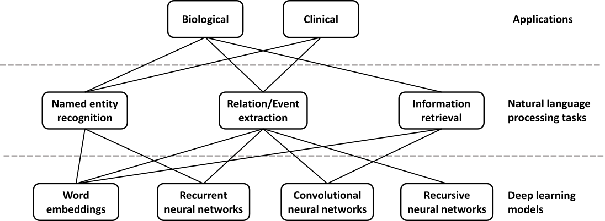

## Deep learning and patient categorization

In healthcare, individuals are diagnosed with a disease or condition based on symptoms, the results of certain diagnostic tests, or other factors.
Once diagnosed with a disease, an individual might be assigned a stage based on another set of human-defined rules.
While these rules are refined over time, the process is evolutionary and ad hoc, potentially impeding the identification of underlying biological mechanisms and their corresponding treatment interventions.

Deep learning methods applied to a large corpus of patient phenotypes may provide a meaningful and more data-driven approach to patient categorization.
For example, they may identify new shared mechanisms that would otherwise be obscured due to ad hoc historical definitions of disease.
Perhaps deep neural networks, by reevaluating data without the context of our assumptions, can reveal novel classes of treatable conditions.

In spite of such optimism, the ability of deep learning models to indiscriminately extract predictive signals must also be assessed and operationalized with care.
Imagine a deep neural network is provided with clinical test results gleaned from electronic health records.
Because physicians may order certain tests based on their suspected diagnosis, a deep neural network may learn to "diagnose" patients simply based on the tests that are ordered.
For some objective functions, such as predicting an International Classification of Diseases (ICD) code, this may offer good performance even though it does not provide insight into the underlying disease beyond physician activity.
This challenge is not unique to deep learning approaches; however, it is important for practitioners to be aware of these challenges and the possibility in this domain of constructing highly predictive classifiers of questionable actual utility.

Our goal in this section is to assess the extent to which deep learning is already contributing to the discovery of novel categories.
Where it is not, we focus on barriers to achieving these goals.
We also highlight approaches that researchers are taking to address challenges within the field, particularly with regards to data availability and labeling.

### Imaging applications in healthcare

Deep learning methods have transformed the analysis of natural images and video, and similar examples are beginning to emerge with medical images.
Deep learning has been used to classify lesions and nodules; localize organs, regions, landmarks and lesions; segment organs, organ substructures and lesions; retrieve images based on content; generate and enhance images; and combine images with clinical reports [@tag:Litjens2017_medimage_survey; @tag:Shen2017_medimg_review].

Though there are many commonalities with the analysis of natural images, there are also key differences.
In all cases that we examined, fewer than one million images were available for training, and datasets are often many orders of magnitude smaller than collections of natural images.
Researchers have developed subtask-specific strategies to address this challenge.

Data augmentation provides an effective strategy for working with small training sets.
The practice is exemplified by a series of papers that analyze images from mammographies [@tag:Dhungel2015_struct_pred_mamm; @tag:Dhungel2016_mamm; @tag:Zhu2016_mult_inst_mamm; @tag:Zhu2016_advers_mamm; @tag:Dhungel2017_mamm_min_interv].
To expand the number and diversity of images, researchers constructed adversarial training examples [@tag:Zhu2016_advers_mamm].
Adversarial training examples are constructed by applying a transformation that changes training images but not their content---for example by rotating an image by a random amount.
An alternative in the domain is to train towards human-created features before subsequent fine-tuning [@tag:Dhungel2016_mamm], which can help to sidestep this challenge though it does give up deep learning techniques' strength as feature constructors.

A second strategy repurposes features extracted from natural images by deep learning models, such as ImageNet [@tag:Russakovsky2015_imagenet], for new purposes.
Diagnosing diabetic retinopathy through color fundus images became an area of focus for deep learning researchers after a large labeled image set was made publicly available during a 2015 Kaggle competition [@tag:Pratt2016_dr].
Most participants trained neural networks from scratch [@tag:Pratt2016_dr; @tag:Abramoff2016_dr; @tag:Leibig2016_dr], but Gulshan et al. [@tag:Gulshan2016_dt] repurposed a 48-layer Inception-v3 deep architecture pre-trained on natural images and surpassed the state-of-the-art specificity and sensitivity.
Such features were also repurposed to detect melanoma, the deadliest form of skin cancer, from dermoscopic [@tag:Codella2016_ensemble_melanoma; @tag:Yu2016_melanoma_resnet] and non-dermoscopic images of skin lesions [@tag:Jafari2016_skin_lesions; @tag:Esfahani2016_melanoma; @tag:Esteva2017_skin_cancer_nature] as well as age-related macular degeneration [@tag:Burlina2016_amd].
Pre-training on natural images can enable very deep networks to succeed without overfitting.
For the melanoma task, reported performance was competitive with or better than a board of certified dermatologists [@tag:Codella2016_ensemble_melanoma; @tag:Esteva2017_skin_cancer_nature].
Reusing features from natural images is also an emerging approach for radiographic images, where datasets are often too small to train large deep neural networks without these techniques [@tag:Bar2015_nonmed_tl; @tag:Shin2016_cad_tl; @tag:Rajkomar2017_radiographs; @tag:Lakhani2017_radiography].
A deep CNN trained on natural images boosts performance in radiographic images [@tag:Rajkomar2017_radiographs].
However, the target task required either re-training the initial model from scratch with special pre-processing or fine-tuning of the whole network on radiographs with heavy data augmentation to avoid overfitting.

The technique of reusing features from a different task falls into the broader area of transfer learning (see Discussion).
Though we've mentioned numerous successes for the transfer of natural image features to new tasks, we expect that a lower proportion of negative results have been published.
The analysis of magnetic resonance images (MRIs) is also faced with the challenge of small training sets.
In this domain, Amit et al. [@tag:Amit2017_breast_mri] investigated the tradeoff between pre-trained models from a different domain and a small CNN trained only with MRI images.
In contrast with the other selected literature, they found a smaller network trained with data augmentation on few hundred images from a few dozen patients can outperform a pre-trained out-of-domain classifier.

Another way of dealing with limited training data is to divide rich data---e.g. 3D images---into numerous reduced projections.
Shin et al. [@tag:Shin2016_cad_tl] compared various deep network architectures, dataset characteristics, and training procedures for computer tomography-based (CT) abnormality detection.
They concluded that networks as deep as 22 layers could be useful for 3D data, despite the limited size of training datasets.
However, they noted that choice of architecture, parameter setting, and model fine-tuning needed is very problem- and dataset-specific.
Moreover, this type of task often depends on both lesion localization and appearance, which poses challenges for CNN-based approaches.
Straightforward attempts to capture useful information from full-size images in all three dimensions simultaneously via standard neural network architectures were computationally unfeasible.
Instead, two-dimensional models were used to either process image slices individually
(2D), or aggregate information from a number of 2D projections in the native space (2.5D).

Roth et al. compared 2D, 2.5D, and 3D CNNs on a number of tasks for computer-aided detection from CT scans and showed that 2.5D CNNs performed comparably well to 3D analogs, while requiring much less training time, especially on augmented training sets [@tag:Roth2015_view_agg_cad].
Another advantage of 2D and 2.5D networks is the wider availability of pre-trained models.
But reducing the dimensionality is not always helpful.
Nie et al.
[@tag:Nie2016_3d_survival] showed that multimodal, multi-channel 3D deep architecture was successful at learning high-level brain tumor appearance features jointly from MRI, functional MRI, and diffusion MRI images, outperforming single-modality or 2D models.
Overall, the variety of modalities, properties and sizes of training sets, the dimensionality of input, and the importance of end goals in medical image analysis are provoking a development of specialized deep neural network architectures, training and validation protocols, and input representations that are not characteristic of widely-studied natural images.

Predictions from deep neural networks can be evaluated for use in workflows that also incorporate human experts.
In a large dataset of mammography images, Kooi et al. [@tag:Kooi2016_mamm_lesions] demonstrated that deep neural networks outperform the traditional computer-aided diagnosis system at low sensitivity and perform comparably at high sensitivity.
They also compared network performance to certified screening radiologists on a patch level and found no significant difference between the network and the readers.
However, using deep methods for clinical practice is challenged by the difficulty of assigning a level of confidence to each prediction.
Leibig et al. [@tag:Leibig2016_dr] estimated the uncertainty of deep networks for diabetic retinopathy diagnosis by linking dropout networks with approximate Bayesian inference.
Techniques that assign confidences to each prediction should aid pathologist-computer interactions and improve uptake by physicians.

Systems to aid in the analysis of histology slides are also promising use cases for deep learning [@tag:Litjens2016_histopath_survey].
Ciresan et al.
[@tag:Ciresan2013_mitosis] developed one of the earliest approaches for histology slides, winning the 2012 International Conference on Pattern Recognition's Contest on Mitosis Detection while achieving human-competitive accuracy.
In more recent work, Wang et al. [@tag:Wang2016_breast_cancer] analyzed stained slides of lymph node slices to identify cancers.
On this task a pathologist has about a 3% error rate.
The pathologist did not produce any false positives, but did have a number of false negatives.
The algorithm had about twice the error rate of a pathologist, but the errors were not strongly correlated.
In this area, these algorithms may be ready to be incorporated into existing tools to aid pathologists and reduce the false negative rate.
Ensembles of deep learning and human experts may help overcome some of the challenges presented by data limitations.

One source of training examples with rich phenotypical annotations is the EHR.
Billing information in the form of ICD codes are simple annotations but phenotypic algorithms can combine laboratory tests, medication prescriptions, and patient notes to generate more reliable phenotypes.
Recently, Lee et al. [@tag:Lee2016_emr_oct_amd] developed an approach to distinguish individuals with age-related macular degeneration from control individuals.
They trained a deep neural network on approximately 100,000 images extracted from structured electronic health records, reaching greater than 93% accuracy.
The authors used their test set to evaluate when to stop training.
In other domains, this has resulted in a minimal change in the estimated accuracy [@tag:Krizhevsky2013_nips_cnn], but we recommend the use of an independent test set whenever feasible.

Rich clinical information is stored in EHRs.
However, manually annotating a large set requires experts and is time consuming.
For chest X-ray studies, a radiologist usually spends a few minutes per example.
Generating the number of examples needed for deep learning is infeasibly expensive.
Instead, researchers may benefit from using text mining to generate annotations [@doi:10.3115/1572392.1572411], even if those annotations are of modest accuracy.
Wang et al. [@arxiv:1705.02315] proposed to build predictive deep neural network models through the use of images with *weak labels*.
Such labels are automatically generated and not verified by humans, so they may be noisy or incomplete.
In this case, they applied a series of natural language processing (NLP) techniques to the associated chest X-ray radiological reports.
They first extracted all diseases mentioned in the reports using a state-of-the-art NLP tool, then applied a new method, NegBio [@arxiv:1712.05898], to filter negative and equivocal findings in the reports.
Evaluation on four independent datasets demonstrated that NegBio is highly accurate for detecting negative and equivocal findings (~90% in F₁ score, which balances precision and recall [@doi:10.1038/nmeth.3945]).
The resulting dataset [@url:https://nihcc.app.box.com/v/ChestXray-NIHCC] consisted of 112,120 frontal-view chest X-ray images from 30,805 patients, and each image was associated with one or more *text-mined* (weakly-labeled) pathology categories (e.g. pneumonia and cardiomegaly) or "no finding" otherwise.
Further, Wang et al. [@arxiv:1705.02315] used this dataset with a unified weakly-supervised multi-label image classification framework, to detect common thoracic diseases.
It showed superior performance over a benchmark using fully-labeled data.

With the exception of natural image-like problems (e.g. melanoma detection), biomedical imaging poses a number of challenges for deep learning.
Datasets are typically small, annotations can be sparse, and images are often high-dimensional, multimodal, and multi-channel.
Techniques like transfer learning, heavy dataset augmentation, and the use of multi-view and multi-stream architectures are more common than in the natural image domain.
Furthermore, high model sensitivity and specificity can translate directly into clinical value.
Thus, prediction evaluation, uncertainty estimation, and model interpretation methods are also of great importance in this domain (see Discussion).
Finally, there is a need for better pathologist-computer interaction techniques that will allow combining the power of deep learning methods with human expertise and lead to better-informed decisions for patient treatment and care.

### Text applications in healthcare

Due to the rapid growth of scholarly publications and EHRs, biomedical text mining has become increasingly important in recent years.
The main tasks in biological and clinical text mining include, but are not limited to, named entity recognition, relation/event extraction, and information retrieval (Figure @fig:biotm).
Deep learning is appealing in this domain because of its competitive performance versus traditional methods and ability to overcome challenges in feature engineering.
Relevant applications can be stratified by the application domain (biomedical literature vs. clinical notes) and the actual task (e.g. concept or relation extraction).

{#fig:biotm width="100%"}

Named entity recognition (NER) is a task of identifying text spans that refer to a biological concept of a specific class, such as disease or chemical, in a controlled vocabulary or ontology.
NER is often needed as a first step in many complex text mining systems.
The current state-of-the-art methods typically reformulate the task as a sequence labeling problem and use conditional random fields [@doi:10.1093/bioinformatics/btw343; @doi:10.1093/bioinformatics/btt156; @doi:10.1093/bioinformatics/btt474].
In recent years, word embeddings that contain rich latent semantic information of words have been widely used to improve the NER performance.
Liu et al. studied the effect of word embeddings on drug name recognition and compared them with traditional semantic features [@doi:10.3390/info6040848].
Tang et al. investigated word embeddings in gene, DNA, and cell line mention detection tasks [@doi:10.1155/2014/240403].
Moreover, Wu et al. examined the use of neural word embeddings for clinical abbreviation disambiguation [@doi:10.18653/v1/w15-3822].
Liu et al. exploited task-oriented resources to learn word embeddings for clinical abbreviation expansion [@doi:10.18653/v1/w15-3810].

Relation extraction involves detecting and classifying semantic relationships between entities from the literature.
At present, kernel methods or feature-based approaches are commonly applied [@doi:10.1371/journal.pcbi.1000837; @doi:10.1186/s13321-016-0165-z; @doi:10.1093/bioinformatics/btp602].
Deep learning can relieve the feature sparsity and engineering problems.
Some studies focused on jointly extracting biomedical entities and relations simultaneously [@tag:li2016joint; @doi:10.1186/s12859-017-1609-9], while others applied deep learning on relation classification given the relevant entities.
For example, both multichannel dependency-based CNNs [@doi:10.18653/v1/w17-2304] and shortest path-based CNNs [@doi:10.1155/2016/8479587; @doi:10.1155/2016/1850404] are well-suited for sentence-based protein-protein extraction.
Jiang et al. proposed a biomedical domain-specific word embedding model to reduce the manual labor of designing semantic representation for the same task [@doi:10.1504/IJDMB.2016.074878].
Gu et al. employed a maximum entropy model and a CNN model for chemical-induced disease relation extraction at the inter- and intra-sentence level, respectively [@doi:10.1093/database/bax024].
For drug-drug interaction, Zhao et al. used a CNN that employs word embeddings with the syntactic information of a sentence as well as features of  part-of-speech tags and dependency trees [@doi:10.1093/bioinformatics/btw486].
Asada et al. experimented with an attention CNN [@doi:10.18653/v1/w17-2302], and Yi et al. a RNN model with multiple attention layers [@arxiv:1705.03261].
In both cases, it is a single model with attention mechanism, which allows the decoder to focus on different parts of the source sentence.
As a result, it does not require dependency parsing or training multiple models.
Both attention CNN and RNN have comparable results, but the CNN model has an advantage in that it can be easily computed in parallel, hence making it faster with recent graphics processing units (GPUs).

For biotopes event extraction, Li et al. employed CNN and distributed representation [@doi:10.18653/v1/w16-3012] while Mehryary et al. used long short-term memory (LSTM) networks to extract complicated relations [@doi:10.18653/v1/w16-3009].
Li et al. applied word embedding to extract complete events from biomedical text and achieved results comparable to the state-of-the-art systems [@doi:10.18653/v1/w15-3814].
There are also approaches that identify event triggers rather than the complete event [@doi:10.1142/S0219720015410012; @arxiv:1705.09516].
Taken together, deep learning models outperform traditional kernel methods or feature-based approaches by 1--5% in f-score.
Among various deep learning approaches, CNN stands out as the most popular model both in terms of computational complexity and performance, while RNN has achieved continuous progress.

Information retrieval is a task of finding relevant text that satisfies an information need from within a large document collection.
While deep learning has not yet achieved the same level of success in this area as seen in others, the recent surge of interest and work suggest that this may be quickly changing.
For example, Mohan et al. described a deep learning approach to modeling the relevance of a document's text to a query, which they applied to the entire biomedical literature [@doi:10.18653/v1/w17-2328].

To summarize, deep learning has shown promising results in many biomedical text mining tasks and applications.
But to realize its full potential in this domain, either large size of labeled data or technical advancements in current methods coping with limited labeled data are required.

### Electronic health records

EHR data include substantial amounts of free text, which remains challenging to approach [@doi:10.1136/amiajnl-2011-000501].
Often, researchers developing algorithms that perform well on specific tasks must design and implement domain-specific features [@doi:10.1136/amiajnl-2011-000150].
These features capture unique aspects of the literature being processed.
Deep learning methods are natural feature constructors.
In recent work, the authors evaluated the extent to which deep learning methods could be applied on top of generic features for domain-specific concept extraction [@arxiv:1611.08373].
They found that performance was in line with, but lower than the best domain-specific method [@arxiv:1611.08373].
This raises the possibility that deep learning may impact the field by reducing the researcher time and cost required to develop specific solutions, but it may not always lead to performance increases.

In recent work, Yoon et al.[@tag:Yoon2016_cancer_reports] analyzed simple features using deep neural networks and found that the patterns recognized by the algorithms could be re-used across tasks.
Their aim was to analyze the free text portions of pathology reports to identify the primary site and laterality of tumors.
The only features the authors supplied to the algorithms were unigrams (counts for single words) and bigrams (counts for two-word combinations) in a free text document.
They subset the full set of words and word combinations to the 400 most common.
The machine learning algorithms that they employed (naïve Bayes, logistic regression, and deep neural networks) all performed relatively similarly on the task of identifying the primary site.
However, when the authors evaluated the more challenging task, evaluating the laterality of each tumor, the deep neural network outperformed the other methods.
Of particular interest, when the authors first trained a neural network to predict primary site and then repurposed those features as a component of a secondary neural network trained to predict laterality, the performance was higher than a laterality-trained neural network.
This demonstrates how deep learning methods can repurpose features across tasks, improving overall predictions as the field tackles new challenges.
The Discussion further reviews this type of transfer learning.

Several authors have created reusable feature sets for medical terminologies using natural language processing and neural embedding models, as popularized by word2vec [@arxiv:1301.3781].
Minarro-Giménez et al. [@doi:10.3233/978-1-61499-432-9-584] applied the word2vec deep learning toolkit to medical corpora and evaluated the efficiency of word2vec in identifying properties of pharmaceuticals based on mid-sized, unstructured medical text corpora without any additional background knowledge.
A goal of learning terminologies for different entities in the same vector space is to find relationships between different domains (e.g. drugs and the diseases they treat).
It is difficult for us to provide a strong statement on the broad utility of these methods.
Manuscripts in this area tend to compare algorithms applied to the same data but lack a comparison against overall best-practices for one or more tasks addressed by these methods.
Techniques have been developed for free text medical notes [@doi:10.1145/2661829.2661974], ICD and National Drug Codes [@doi:10.18653/v1/w17-2342; @tag:world2004international], and claims data [@doi:10.1145/2939672.2939823].
Methods for neural embeddings learned from electronic health records have at least some ability to predict disease-disease associations and implicate genes with a statistical association with a disease [@doi:10.1038/srep32404], but the evaluations performed did not differentiate between simple predictions (i.e. the same disease in different sites of the body) and non-intuitive ones.
Jagannatha and Yu  [@pmcid:PMC5119627] further employed a bidirectional LSTM structure to extract adverse drug events from electronic health records, and Lin et al. [@doi:10.18653/v1/w17-2341] investigated using CNN to extract temporal relations.
While promising, a lack of rigorous evaluations of the real-world utility of these kinds of features makes current contributions in this area difficult to evaluate.
Comparisons need to be performed to examine the true utility against leading approaches (i.e. algorithms and data) as opposed to simply evaluating multiple algorithms on the same potentially limited dataset.

Identifying consistent subgroups of individuals and individual health trajectories from clinical tests is also an active area of research.
Approaches inspired by deep learning have been used for both unsupervised feature construction and supervised prediction.
Early work by Lasko et al. [@doi:10.1371/journal.pone.0066341], combined sparse autoencoders and Gaussian processes to distinguish gout from leukemia from uric acid sequences.
Later work showed that unsupervised feature construction of many features via denoising autoencoder neural networks could dramatically reduce the number of labeled examples required for subsequent supervised analyses [@doi:10.1016/j.jbi.2016.10.007].
In addition, it pointed towards features learned during unsupervised training being useful for visualizing and stratifying subgroups of patients within a single disease.
In a concurrent large-scale analysis of EHR data from 700,000 patients, Miotto et al.
[@doi:10.1038/srep26094] used a deep denoising autoencoder architecture applied to the number and co-occurrence of clinical events to learn a representation of patients (DeepPatient).
The model was able to predict disease trajectories within one year with over 90% accuracy and patient-level predictions were improved by up to 15% when compared to other methods.
Choi et al. [@arxiv:1511.05942] attempted to model the longitudinal structure of EHRs with a RNN to predict future diagnosis and medication prescriptions on a cohort of 260,000 patients followed for 8 years (Doctor AI).
Pham et al.
[@arxiv:1602.00357] built upon this concept by using a RNN with a LSTM architecture enabling explicit modelling of patient trajectories through the use of memory cells.
The method, DeepCare, performed better than shallow models or plain RNN when tested on two independent cohorts for its ability to predict disease progression, intervention recommendation and future risk prediction.
Nguyen et al. [@doi:10.1109/JBHI.2016.2633963] took a different approach and used word embeddings from EHRs to train a CNN that could detect and pool local clinical motifs to predict unplanned readmission after six months, with performance better than the baseline method (Deepr).
Razavian et al. [@arxiv:1608.00647] used a set of 18 common lab tests to predict disease onset using both CNN and LSTM architectures and demonstrated an improvement over baseline regression models.
However, numerous challenges including data integration (patient demographics, family history, laboratory tests, text-based patient records, image analysis, genomic data) and better handling of streaming temporal data with many features, will need to be overcome before we can fully assess the potential of deep learning for this application area.

Still, recent work has also revealed domains in which deep networks have proven superior to traditional methods.
Survival analysis models the time leading to an event of interest from a shared starting point, and in the context of EHR data, often associates these events to subject covariates.
Exploring this relationship is difficult, however, given that EHR data types are often heterogeneous, covariates are often missing, and conventional approaches require the covariate-event relationship be linear and aligned to a specific starting point [@arxiv:1608.02158].
Early approaches, such as the Faraggi-Simon feed-forward network, aimed to relax the linearity assumption, but performance gains were lacking [@tag:Xiang].
Katzman et al. in turn developed a deep implementation of the Faraggi-Simon network that, in addition to outperforming Cox regression, was capable of comparing the risk between a given pair of treatments, thus potentially acting as recommender system [@arxiv:1606.00931].
To overcome the remaining difficulties, researchers have turned to deep exponential families, a class of latent generative models that are constructed from any type of exponential family distributions [@arxiv:1411.2581v1].
The result was a deep survival analysis model capable of overcoming challenges posed by missing data and heterogeneous data types, while uncovering nonlinear relationships between covariates and failure time.
They showed their model more accurately stratified patients as a function of disease risk score compared to the current clinical implementation.

There is a computational cost for these methods, however, when compared to traditional, non-neural network approaches.
For the exponential family models, despite their scalability [@arxiv:1206.7051], an important question for the investigator is whether he or she is interested in estimates of posterior uncertainty.
Given that these models are effectively Bayesian neural networks, much of their utility simplifies to whether a Bayesian approach is warranted for a given increase in computational cost.
Moreover, as with all variational methods, future work must continue to explore just how well the posterior distributions are approximated, especially as model complexity increases [@arxiv:1511.02386].

### Challenges and opportunities in patient categorization

#### Generating ground-truth labels can be expensive or impossible

A dearth of true labels is perhaps among the biggest obstacles for EHR-based analyses that employ machine learning.
Popular deep learning (and other machine learning) methods are often used to tackle classification tasks and thus require ground-truth labels for training.
For EHRs this can mean that researchers must hire multiple clinicians to manually read and annotate individual patients' records through a process called chart review.
This allows researchers to assign "true" labels, i.e. those that match our best available knowledge.
Depending on the application, sometimes the features constructed by algorithms also need to be manually validated and interpreted by clinicians.
This can be time consuming and expensive [@doi:10.1016/j.ijmedinf.2016.09.014].
Because of these costs, much of this research, including the work cited in this review, skips the process of expert review.
Clinicians' skepticism for research without expert review may greatly dampen their enthusiasm for the work and consequently reduce its impact.
To date, even well-resourced large national consortia have been challenged by the task of acquiring enough expert-validated labeled data.
For instance, in the eMERGE consortia and PheKB database [@url:https://phekb.org/implementations], most samples with expert validation contain only 100 to 300 patients.
These datasets are quite small even for simple machine learning algorithms.
The challenge is greater for deep learning models with many parameters.
While unsupervised and semi-supervised approaches can help with small sample sizes, the field would benefit greatly from large collections of anonymized records in which a substantial number of records have undergone expert review.
This challenge is not unique to EHR-based studies.
Work on medical images, omics data in applications for which detailed metadata are required, and other applications for which labels are costly to obtain will be hampered as long as abundant curated data are unavailable.

Successful approaches to date in this domain have sidestepped this challenge by making methodological choices that either reduce the need for labeled examples or that use transformations to training data to increase the number of times it can be used before overfitting occurs.
For example, the unsupervised and semi-supervised methods that we have discussed reduce the need for labeled examples [@doi:10.1016/j.jbi.2016.10.007].
The anchor and learn framework [@doi:10.1093/jamia/ocw011] uses expert knowledge to identify high-confidence observations from which labels can be inferred.
The strategies of adversarial training mentioned above can reduce overfitting, if transformations are available that preserve the meaningful content of the data while transforming irrelevant features [@doi:10.1101/095786].
While adversarial training examples can be easily imagined for certain methods that operate on images, it is more challenging to figure out what an equivalent transformation would be for a patient's clinical test results.
Consequently, it may be hard to employ adversarial training examples with other applications.
Finally, approaches that transfer features can also help use valuable training data most efficiently.
Rajkomar et al. trained a deep neural network using generic images before tuning using only radiology images [@doi:10.1007/s10278-016-9914-9].
Datasets that require many of the same types of features might be used for initial training, before fine tuning takes place with the more sparse biomedical examples.
Though the analysis has not yet been attempted, it is possible that analogous strategies may be possible with electronic health records.
For example, features learned from the electronic health record for one type of clinical test (e.g. a decrease over time in a lab value) may transfer across phenotypes.
Methods to accomplish more with little high-quality labeled data arose in other domains and may also be adapted to this challenge, e.g. data programming [@arxiv:1605.07723].
In data programming, noisy automated labeling functions are integrated.

Numerous commentators have described data as the new oil [@url:http://ana.blogs.com/maestros/2006/11/data_is_the_new.html; @url:https://medium.com/twenty-one-hundred/data-is-the-new-oil-a-ludicrous-proposition-1d91bba4f294].
The idea behind this metaphor is that data are available in large quantities, valuable once refined, and this underlying resource  will enable a data-driven revolution in how work is done.
Contrasting with this perspective, Ratner, Bach, and Ré described labeled training data, instead of data, as "The _New_ New Oil"
[@url:http://hazyresearch.github.io/snorkel/blog/weak_supervision.html].
In this framing, data are abundant and not a scarce resource.
Instead, new approaches to solving problems arise when labeled training data become sufficient to enable them.
Based on our review of research on deep learning methods to categorize disease, the latter framing rings true.

We expect improved methods for domains with limited data to play an important role if deep learning is going to transform how we categorize states of human health.
We don't expect that deep learning methods will replace expert review.
We expect them to complement expert review by allowing more efficient use of the costly practice of manual annotation.

#### Data sharing is hampered by standardization and privacy considerations

To construct the types of very large datasets that deep learning methods thrive on, we need robust sharing of large collections of data.
This is in part a cultural challenge.
We touch on this challenge in Discussion.
Beyond the cultural hurdles around data sharing, there are also technological and legal hurdles related to sharing individual health records or deep models built from such records.
This subsection deals primarily with these challenges.

EHRs are designed chiefly for clinical, administrative and financial purposes, such as patient care, insurance and  billing [@doi:10.1038/nrg3208].
Science is at best a tertiary priority, presenting challenges to EHR-based research in general and to deep learning research in particular.
Although there is significant work in the literature around EHR data quality and the impact on research [@doi:10.1136/amiajnl-2011-000681], we focus on three types of challenges: local bias, wider standards, and legal issues.
Note these problems are not restricted to EHRs but can also apply to any large biomedical dataset, e.g. clinical trial data.

Even within the same healthcare system, EHRs can be used differently [@pmcid:PMC3797550; @pmcid:PMC3041534].
Individual users have unique documentation and ordering patterns, with different departments and different hospitals having different priorities that code patients and introduce missing data in a non-random fashion [@tag:Serden].
Patient data may be kept across several "silos" within a single health system (e.g. separate nursing documentation, registries, etc.).
Even the most basic task of matching patients across systems can be challenging due to data entry issues [@pmcid:PMC4832129].
The situation is further exacerbated by the ongoing introduction, evolution, and migration of EHR systems, especially where reorganized and acquired healthcare facilities have to merge.
Further, even the ostensibly least-biased data type, laboratory measurements, can be biased based by both the healthcare process and patient health state [@doi:10.1016/j.jbi.2014.03.016].
As a result, EHR data can be less complete and less objective than expected.

In the wider picture, standards for EHRs are numerous and evolving.
Proprietary systems, indifferent and scattered use of health information standards, and controlled terminologies makes combining and comparison of data across systems challenging [@doi:10.1016/j.jbi.2014.10.006].
Further diversity arises from variation in languages, healthcare practices, and demographics.
Merging EHRs gathered in different systems (and even under different assumptions) is challenging [@doi:10.1007/978-3-319-44839-8].

Combining or replicating studies across systems thus requires controlling for both the above biases and dealing with mismatching standards.
This has the practical effect of reducing cohort size, limiting statistical significance, preventing the detection of weak effects [@doi:10.1590/2176-9451.19.4.027-029.ebo], and restricting the number of parameters that can be trained in a model.
Further, rules-based algorithms have been popular in EHR-based research, but because these are developed at a single institution and trained with a specific patient population, they do not transfer easily to other healthcare systems [@doi:10.1136/amiajnl-2013-001935].
Genetic studies using EHR data are subject to even more bias, as the differences in population ancestry across health centers (e.g. proportion of patients with African or Asian ancestry) can affect algorithm performance.
For example, Wiley et al. [@doi:10.1142/9789813207813_0050] showed that warfarin dosing algorithms often under-perform in African Americans, illustrating that some of these issues are unresolved even at a treatment best practices level.
Lack of standardization also makes it challenging for investigators skilled in deep learning to enter the field, as numerous data processing steps must be performed before algorithms are applied.

Finally, even if data were perfectly consistent and compatible across systems, attempts to share and combine EHR data face considerable legal and ethical barriers.
Patient privacy can severely restrict the sharing and use of EHR data [@doi:10.1093/ije/dyn022].
Here again, standards are heterogeneous and evolving, but often EHR data can often not be exported or even accessed directly for research purposes without appropriate consent.
In the United States, research use of EHR data is subject both to the Common Rule and the Health Insurance Portability and Accountability Act (HIPAA).
Ambiguity in the regulatory language and individual interpretation of these rules can hamper use of EHR data [@doi:10.1093/jamia/ocv111].
Once again, this has the effect of making data gathering more laborious and expensive, reducing sample size and study power.

Several technological solutions have been proposed in this direction, allowing access to sensitive data satisfying privacy and legal concerns.
Software like DataShield [@doi:10.1093/ije/dyu188] and ViPAR [@doi:10.1093/ije/dyv193], although not EHR-specific, allow querying and combining of datasets and calculation of summary statistics across remote sites by "taking the analysis to the data".
The computation is carried out at the remote site.
Conversely, the EH4CR project [@doi:10.1016/j.jbi.2014.10.006] allows analysis of private data by use of an inter-mediation layer that interprets remote queries across internal formats and datastores and returns the results in a de-identified standard form, thus giving real-time consistent but secure access.
Continuous Analysis [@doi:10.1038/nbt.3780] can allow reproducible computing on private data.
Using such techniques, intermediate results can be automatically tracked and shared without sharing the original data.
While none of these have been used in deep learning, the potential is there.

Even without sharing data, algorithms trained on confidential patient data may present security risks or accidentally allow for the exposure of individual level patient data.
Tramer et al. [@arxiv:1609.02943] showed the ability to steal trained models via public application programming interfaces (APIs).
Dwork and Roth [@doi:10.1561/0400000042] demonstrate the ability to expose individual level information from accurate answers in a machine learning model.
Attackers can use similar attacks to find out if a particular data instance was present in the original training set for the machine learning model [@arxiv:1610.05820], in this case, whether a person's record was present.
To protect against these attacks, Simmons et al. [@doi:10.1016/j.cels.2016.04.013] developed the ability to perform genome-wide association studies (GWASs) in a differentially private manner, and Abadi et al. [@doi:10.1145/2976749.2978318] show the ability to train deep learning classifiers under the differential privacy framework.

These attacks also present a potential hazard for approaches that aim to generate data.
Choi et al. propose generative adversarial neural networks (GANs) as a tool to make sharable EHR data [@arxiv:1703.06490v1], and Esteban et al. [@arxiv:1706.02633v1] showed that recurrent GANs could be used for time series data.
However, in both cases the authors did not take steps to protect the model from such attacks.
There are approaches to protect models, but they pose their own challenges.
Training in a differentially private manner provides a limited guarantee that an algorithm's output will be equally likely to occur regardless of the participation of any one individual.
The limit is determined by parameters which provide a quantification of privacy.
Beaulieu-Jones et al. demonstrated the ability to generate data that preserved properties of the SPRINT clinical trial with GANs under the differential privacy framework [@doi:10.1101/159756].
Both Beaulieu-Jones et al. and Esteban et al. train models on synthetic data generated under differentially private and observe performance from a transfer learning evaluation that is only slightly below models trained on the original, real data.
Taken together, these results suggest that differentially private GANs may be an attractive way to generate sharable datasets for downstream reanalysis.

Federated learning [@url:http://proceedings.mlr.press/v54/mcmahan17a.html] and secure aggregations [@url:https://eprint.iacr.org/2017/281.pdf
@tag:Papernot2017_pate] are complementary approaches that reinforce differential privacy.
Both aim to maintain privacy by training deep learning models from decentralized data sources such as personal mobile devices without transferring actual training instances.
This is becoming of increasing importance with the rapid growth of mobile health applications.
However, the training process in these approaches places constraints on the algorithms used and can make fitting a model substantially more challenging.
It can be trivial to train a model without differential privacy, but quite difficult to train one within the differential privacy framework [@doi:10.1101/159756].
This problem can be particularly pronounced with small sample sizes.

While none of these problems are insurmountable or restricted to deep learning, they present challenges that cannot be ignored.
Technical evolution in EHRs and data standards will doubtless ease---although not solve---the problems of data sharing and merging.
More problematic are the privacy issues.
Those applying deep learning to the domain should consider the potential of inadvertently disclosing the participants' identities.
Techniques that enable training on data without sharing the raw data may have a part to play.
Training within a differential privacy framework may often be warranted.

#### Discrimination and "right to an explanation" laws

In April 2016, the European Union adopted new rules regarding the use of personal information, the General Data Protection Regulation [@arxiv:1606.08813v3].
A component of these rules can be summed up by the phrase
"right to an explanation".
Those who use machine learning algorithms must be able to explain how a decision was reached.
For example, a clinician treating a patient who is aided by a machine learning algorithm may be expected to explain decisions that use the patient's data.
The new rules were designed to target categorization or recommendation systems, which inherently profile individuals.
Such systems can do so in ways that are discriminatory and unlawful.

As datasets become larger and more complex, we may begin to identify relationships in data that are important for human health but difficult to understand.
The algorithms described in this review and others like them may become highly accurate and useful for various purposes, including within medical practice.
However, to discover and avoid discriminatory applications it will be important to consider interpretability alongside accuracy.
A number of properties of genomic and healthcare data will make this difficult.

First, research samples are frequently non-representative of the general population of interest; they tend to be disproportionately sick [@doi:10.1086/512821], male [@doi:10.1016/j.neubiorev.2010.07.002], and European in ancestry [@doi:10.1371/journal.pbio.1001661].
One well-known consequence of these biases in genomics is that penetrance is consistently lower in the general population than would be implied by case-control data, as reviewed in [@doi:10.1086/512821].
Moreover, real genetic associations found in one population may not hold in other populations with different patterns of linkage disequilibrium (even when population stratification is explicitly controlled for [@doi:10.1038/nrg2813]).
As a result, many genomic findings are of limited value for people of non-European ancestry [@doi:10.1371/journal.pbio.1001661] and may even lead to worse treatment outcomes for them.
Methods have been developed for mitigating some of these problems in genomic studies [@doi:10.1086/512821; @doi:10.1038/nrg2813], but it is not clear how easily they can be adapted for deep models that are designed specifically to extract subtle effects from high-dimensional data.
For example, differences in the equipment that tended to be used for cases versus controls have led to spurious genetic findings (e.g. Sebastiani et al.'s retraction [@doi:10.1126/science.333.6041.404-a]).
In some contexts, it may not be possible to correct for all of these differences to the degree that a deep network is unable to use them.
Moreover, the complexity of deep networks makes it difficult to determine when their predictions are likely to be based on such nominally-irrelevant features of the data (called "leakage" in other fields [@doi:10.1145/2382577.2382579]).
When we are not careful with our data and models, we may inadvertently say more about the way the data was collected (which may involve a history of unequal access and discrimination) than about anything of scientific or predictive value.
This fact can undermine the privacy of patient data [@doi:10.1145/2382577.2382579] or lead to severe discriminatory consequences [@doi:10.1111/j.1740-9713.2016.00960.x].

There is a small but growing literature on the prevention and mitigation of data leakage [@doi:10.1145/2382577.2382579], as well as a closely-related literature on discriminatory model behavior [@arxiv:1610.02413], but it remains difficult to predict when these problems will arise, how to diagnose them, and how to resolve them in practice.
There is even disagreement about which kinds of algorithmic outcomes should be considered discriminatory [@arxiv:1610.09559].
Despite the difficulties and uncertainties, machine learning practitioners (and particularly those who use deep neural networks, which are challenging to interpret) must remain cognizant of these dangers and make every effort to prevent harm from discriminatory predictions.
To reach their potential in this domain, deep learning methods will need to be interpretable (see Discussion).
Researchers need to consider the extent to which biases may be learned by the model and whether or not a model is sufficiently interpretable to identify bias.
We discuss the challenge of model interpretability more thoroughly in Discussion.

#### Applications of deep learning to longitudinal analysis

Longitudinal analysis follows a population across time, for example, prospectively from birth or from the onset of particular conditions.
In large patient populations, longitudinal analyses such as the Framingham Heart Study [@tag:Mahmood] and the Avon Longitudinal Study of Parents and Children [@doi:10.1038/484155a] have yielded important discoveries about the development of disease and the factors contributing to health status.
Yet, a common practice in EHR-based research is to take a snapshot at a point in time and convert patient data to a traditional vector for machine learning and statistical analysis.
This results in loss of information as timing and order of events can provide insight into a patient's disease and treatment [@doi:10.2307/2281868].
Efforts to model sequences of events have shown promise [@doi:10.1038/ncomms5022] but require exceedingly large patient sizes due to discrete combinatorial bucketing.
Lasko et al. [@doi:10.1371/journal.pone.0066341] used autoencoders on longitudinal sequences of serum uric acid measurements to identify population subtypes.
More recently, deep learning has shown promise working with both sequences (CNNs)
[@arxiv:1607.07519] and the incorporation of past and current state (RNNs, LSTMs) [@arxiv:1602.00357].
This may be a particular area of opportunity for deep neural networks.
The ability to recognize relevant sequences of events from a large number of trajectories requires powerful and flexible feature construction methods---an area in which deep neural networks excel.
